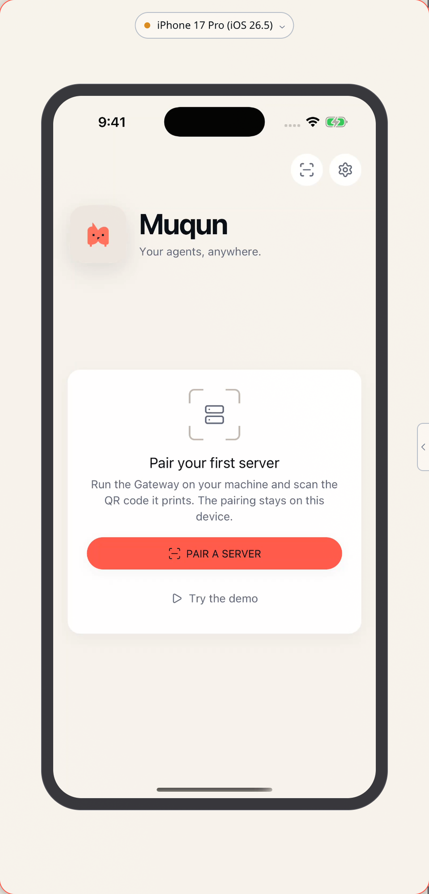

# Omarchy Simfarm

Watch and drive the iOS, Android, and WeChat simulators running on a Mac,
from the Omarchy bar. The widget shows how many devices are booted; clicking
opens a floating panel that streams one of them and takes your clicks and
keystrokes.

<p align="center">
  
</p>

<p align="center">
  <a href="docs/preview.mp4">▶ Watch it being driven</a> (11s)
</p>

The plugin is the way in. The streaming, the input, and the panel itself come
from [simfarm](https://github.com/BANG88/simfarm) running on the Mac.

## Features

- One click from the bar to a floating panel showing a booted simulator.
- Each device drawn at its real size — one device point to one screen pixel,
  so a 17pt label looks 17pt. Zoom out when it does not fit.
- Hardware keys, typing (Chinese included), rotation, and a device picker that
  connects on selection. A device that is off gets a Start button.
- The panel wears the current Omarchy theme and follows it when you switch,
  including light and dark on devices that can change appearance.
- Nothing is connected while the panel is closed. The tunnel lives exactly as
  long as the window, and the widget is a launcher until you open one — no
  polling a Mac nobody is looking at. Open, the tooltip carries the booted
  count. The widget stays hidden until it is pointed at a Mac.

## Requirements

- Omarchy Shell with third-party plugin support
- A Mac running [simfarm](https://github.com/BANG88/simfarm), reachable from
  this desktop
- `chromium`, `ssh`, `curl`, and `node` on the desktop
- For a plain `http://` simfarm address: key-based SSH to that Mac (the tunnel
  runs non-interactively, so password prompts fail closed). Not needed when
  simfarm is served over HTTPS.

## Install

```bash
omarchy plugin add https://github.com/ryuhzk/omarchy-simfarm --enable --yes
```

Or from a local clone:

```bash
omarchy plugin validate ~/path/to/omarchy-simfarm
omarchy plugin add file://$HOME/path/to/omarchy-simfarm --enable --yes
```

## Remove

```bash
omarchy plugin remove ryuhzk.simfarm
```

This unregisters the plugin and deletes its installed files. Three things live
outside it and are left alone:

- the widget's settings in `~/.config/omarchy/shell.json`
- the window rule, if you added one to `~/.config/hypr/hyprland.lua`
- the theme hook, if you installed one — remove it with
  `rm ~/.config/omarchy/hooks/theme-set.d/theme-set`

Its own state (`~/.local/state/simfarm`) and browser profile
(`~/.local/share/simfarm`) can go too. Nothing was installed on the Mac.

## Pointing it at a Mac

Open **Setup › Plugins › Simfarm** and set the simfarm URL. The panel needs a
**secure origin**, because that is the only place browsers expose the video
decoder. Two ways to have one:

- **Serve simfarm over HTTPS** and give that URL. Tailscale HTTPS, a reverse
  proxy with a certificate, anything with TLS. Nothing is tunnelled.
- **Give a plain `http://` URL and an SSH host.** A tunnel is opened on demand
  so the panel loads from `127.0.0.1`, which browsers also trust.

Getting this wrong is quiet rather than loud: the socket connects, the server
streams, and the picture sits on its first frame.

### Letting the panel float

The panel is sized to the device, which only means anything if the window is
floating. Add to the bottom of `~/.config/hypr/hyprland.lua`:

```lua
o.window({ class = "^chrome-.*__-Simfarm$" }, {
  float = true,
  center = true,
  size = { 500, 1040 },
})
```

Chromium builds the class from the origin's host and the profile directory.
The host half varies with how you reach the panel, which is why it is
wildcarded; the profile half is this plugin's alone, so the rule moves no
other window.

### Following theme changes while open

```bash
omarchy hook install theme-set ~/.config/omarchy/plugins/ryuhzk.simfarm/hooks/theme-set
```

Without it the panel still picks up the theme each time it opens.

## What stays connected

Nothing, once the panel is closed.

Opening the panel starts the ssh tunnel (for a plain `http://` address) and the
launcher stays alive alongside the window. Close the window and the launcher
takes the tunnel down with it. While no window is open the bar widget does not
reach the network at all — it reads a local file, sees there is no panel, and
says "click to open the panel". The booted count appears in the tooltip only
while a panel is up.

A tunnel that was already listening on the port when the panel opened is left
alone on the way out — it belongs to something else.

## Settings

| Key                  | Default   | Description                                              |
| -------------------- | --------- | -------------------------------------------------------- |
| `serverUrl`          | *(empty)* | Where simfarm is reachable, `https://…` or `http://…`     |
| `sshHost`            | *(empty)* | ssh target for the tunnel; only for a plain `http://` URL |
| `localPort`          | `8801`    | This end of the tunnel; ignored for `https`              |
| `refreshIntervalSec` | `20`      | How often the bar re-reads the booted count              |

## Diagnosing

Open the panel from a terminal to see why it will not start:

```bash
~/.config/omarchy/plugins/ryuhzk.simfarm/bin/simfarm-open \
  --url http://<addr>:8801 --ssh <user@host> --local-port 8801
```

Print the theme the panel would be given:

```bash
~/.config/omarchy/plugins/ryuhzk.simfarm/bin/simfarm-theme --print
```

Logs live in `~/.local/state/simfarm/` — `tunnel.log` and `browser.log`.

## Development

```bash
omarchy plugin validate .
omarchy restart shell     # reloads plugin code and rebuilds the bar
```

Saving a file under `~/.config/omarchy/plugins/` usually reloads it, but a
`git pull` does not always trip the watcher — restart the shell if a change
does not show up.

## Security notes

- The tunnel is an ordinary `ssh -L` to a host you name, with
  `ExitOnForwardFailure` so a taken port fails loudly instead of forwarding
  nowhere. Nothing is installed on the Mac.
- The panel runs in its own browser profile, so it shares no cookies or
  sessions with your normal browsing.
- simfarm itself has no authentication. Reach it over Tailscale or an SSH
  tunnel; do not expose it to a network you do not control.
- **A tunnel bounds which machines can reach simfarm, not which pages.** It
  checks no `Origin` and asks for no credentials, so while the tunnel is up, any
  plain-`http://` page open in any browser on this machine can open the same
  socket, watch the simulator and type into it. Verified, not theoretical. HTTPS
  pages cannot — browsers refuse `ws://` from a secure page — so the exposure is
  plain-HTTP pages and anything able to tamper with one. It is part of why the
  tunnel now closes with the panel window rather than staying up.
- The theme bridge opens a Chromium debugging port bound to localhost, used
  only to push theme values into the open panel.

## License

[MIT](./LICENSE)
